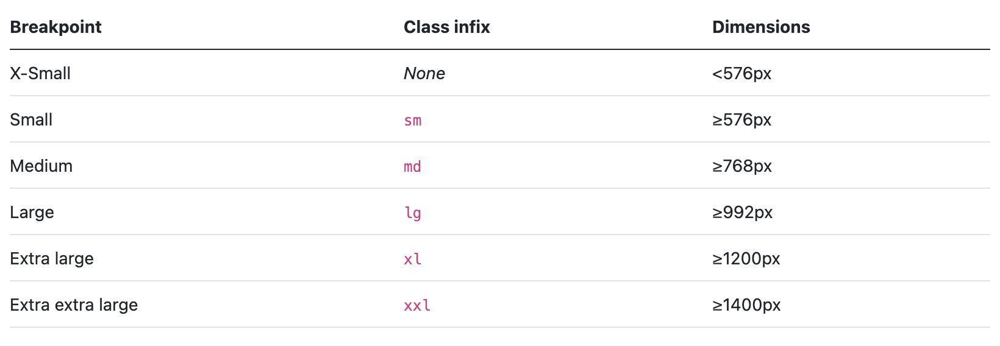

# Breakpoints



Translate to:

```
body {
  background-color: green;
}

@media (min-width: 576px) {
  body {
    background-color: aquamarine;
  }
}

@media (min-width: 768px) {
  body {
    background-color: darkred;
  }
}

@media (min-width: 992px) {
  body {
    background-color: purple;
  }
}

@media (min-width: 1200px) {
  body {
    background-color: lightyellow;
  }
}

@media (min-width: 1400px) {
  body {
    background-color: pink;
  }
}
```
